# Crisis Connect — Mind Map

Renders in GitHub, Obsidian, and any Mermaid-compatible viewer.

```mermaid
mindmap
  root((Crisis Connect))
    Core Concept
      Map is the entire app
      Drop a pin to need help
      Drop a pin to offer help
      AI ranks who needs it most
      No middleman — peer to peer

    Map Behavior
      Zoomed Out
        Heatmap layer
        Density = open crises
        Color gradient blue to red
        No personal data shown
      Zoomed In
        Individual colored dots
        Red = Critical
        Orange = High
        Yellow = Medium
        Blue = Offer
        Gray = Fulfilled
      Interactions
        Tap dot → bottom sheet
        Search bar overlaid
        Locate Me button
        Plus button → post form
        Real-time ripple on new post

    Posts
      Type
        Need
        Offer
      Categories
        Water
        Food
        Medical
        Shelter
        Rescue
        Other
      Fields
        Title 120 chars
        Description
        Photos up to 3
        Location pin
        People affected
        Self-reported urgency
      Lifecycle
        Open
        Claimed
        Fulfilled

    AI Features
      Triage Scoring
        0 to 100 score on submit
        Determines dot color
        Claude Haiku model
        Async non-blocking
        Time decay every 30min
      Natural Language Search
        User types water near me
        Claude parses intent
        Returns filter object
        Dots update instantly
      Crisis Briefing
        Button on map
        Claude summarizes visible posts
        Finds unmatched need plus offer pairs
        ElevenLabs reads it aloud
      Voice Posts
        Tap mic button
        Speak your need
        ElevenLabs STT transcribes
        AI structures the fields
        Auto submits post
      Nearby Alert Audio
        Critical post within 1km
        ElevenLabs reads alert aloud
        Eyes-up UX for disaster
      Chat Safety Filter
        Every message screened
        Blocks phone numbers
        Blocks emails
        Blocks scam attempts

    Chat System
      In-app only
      Scoped per post
      Real-time via Socket.io
      No phone numbers ever shown
      No emails ever shown
      Message deletion

    Security
      Passkey auth via WebAuthn
      JWT fallback
      Phone for login only
      Location approximate only
      Security transparency page
      Fulfilled posts auto-archive TTL

    Tech Stack
      Frontend
        React plus Vite
        TypeScript
        Tailwind CSS
        ShadCN UI
        react-leaflet
        leaflet.heat
        Zustand
        React Query
        Socket.io client
      Backend
        NestJS
        TypeScript
        MongoDB Atlas
        Socket.io gateway
        JWT plus Passkeys
        Claude API
        ElevenLabs API
      Infrastructure
        Vercel frontend
        Railway backend
        MongoDB Atlas free tier
        crisisconnect.tech domain

    Prize Targets
      1st Place 3388 CAD
        Main build
        AI depth
        Real world impact
        Demo polish
      Best Design 120 CAD
        Pulse animation on critical dots
        Smooth bottom sheet
        Mobile responsive
      ElevenLabs Wireless Earbuds
        Voice briefing TTS
        Voice post STT
        Nearby audio alert
        Enter MLH and ElevenLabs Challenge
      MongoDB Atlas IoT Kit
        2dsphere geospatial index
        Atlas Search
        Change streams for realtime
        Already using it
      Tech Domain mic plus 10yr domain
        Register crisisconnect.tech
        5 minutes
      1Password 400 CAD
        Passkey WebAuthn auth
        Security transparency page
        Message deletion
      Best Wellness 325 CAD
        Community agency framing
        Fulfilled connections counter
        Pitch reframe only

    Demo Script 2 min
      Open map
        Heatmap visible at city level
        Zoom in — dots appear
        Red pulsing critical dot
      Tap a dot
        Bottom sheet slides up
        AI summary shown
        Voice briefing button
      Play voice briefing
        ElevenLabs reads crisis aloud
        Judges hear real impact
      Post a need via voice
        Tap mic
        Speak a need
        Post appears on map
      Chat
        Tap Message them
        Real-time chat opens
        No phone number anywhere
      Crisis briefing
        AI finds unmatched pair
        Highlights match on map
```



---

## Feature Priority Matrix

```
                    HIGH DEMO IMPACT
                          │
    Voice Briefing        │   Heatmap → Dots
    Voice Post            │   AI Triage + Decay
    Post Matching         │   NL Search
                          │
LOW BUILD ────────────────┼──────────────── HIGH BUILD
    EFFORT                │                   EFFORT
                          │
    .Tech Domain          │   Passkey Auth
    MongoDB docs          │   Full E2E encryption
    Nearby Audio Alert    │   Push notifications
                          │
                    LOW DEMO IMPACT
```

**Top-left quadrant = build first.** High impact, low effort.
**Top-right quadrant = build second.** High impact, worth the time.
**Bottom-left = do it in 10 minutes.** Free prizes.
**Bottom-right = skip.** Not worth the 24hr budget.
```
